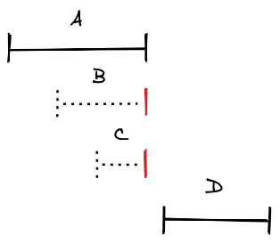
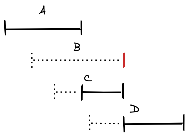
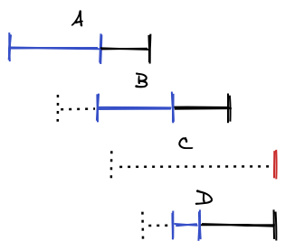
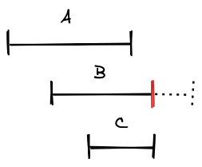
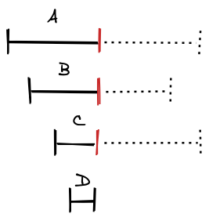

One of my goals when authoring Crank.js was to create a framework which was so simple that any intermediate JavaScript developer could conceivably write it from scratch without reference. What I think makes this uniquely achievable for Crank is that its component model is built on top of JavaScript’s two main control flow abstractions, iterators and promises, allowing developers to write components exclusively with sync and async functions and generator functions.

The following is an attempt to prove that I’ve met this goal by rewriting the bulk of Crank’s core logic as a series of additive commits, with explanations of what I’m doing at each step.
<!-- truncate -->

Even if you don’t plan on using Crank, this essay may yet prove informative in that it will demonstrate the basics of how virtual DOM libraries work, and show you some advanced techniques for working with iterators and promises. I will also use this essay to justify some of the design decisions I made along the way, as I make them. Moreover, the end result won’t just be a toy library, but something which looks very similar to Crank’s actual source code, making the jump from reading this essay to contributing to the project much easier, should you be so inclined.

At each step, we’ll edit a single file which serves as the Crank module, and present a unified diff of the changes. You can play with this module by downloading and referencing it from the following HTML file.

```html
<!DOCTYPE HTML>
<html>
<head>
  <meta charset="utf-8"/>
  <title>Crank from Scratch</title>
  <script src="https://unpkg.com/@babel/standalone/babel.min.js"></script>
  <script>
  Babel.registerPreset("crank", {
    presets: [
      [Babel.availablePresets.react, {
        runtime: "classic",
        pragma: "createElement",
        pragmaFrag: "''",
      }],
    ],
  });
  </script>
</head>
<body>
  <div id="app"></div>
  <script type="text/babel" data-type="module" data-presets="crank">
import {createElement, Renderer} from "./crank.js";
const renderer = new Renderer();
const app = document.getElementById("app");
renderer.render(
  <div>Hello <span style="color: red;">world</span></div>,
  app,
);
  </script>
</body>
</html>
```

This HTML file uses the [Babel standalone transpiler](https://babeljs.io/docs/en/babel-standalone) to transpile JSX on the fly. We don’t transpile modern ECMAScript features, so you will need to open the file from an up-to-date browser. Alternatively, if you don’t want to use JSX, you can use the [HTM template tag](https://github.com/developit/htm), which requires no transpilation. The examples in this essay will use JSX, but you are free to use HTM or any other alternative.

```html
<!DOCTYPE HTML>
<html>
<head>
  <meta charset="utf-8"/>
  <title>Crank from Scratch</title>
</head>
<body>
  <div id="app"></div>
  <script type="module">
import htm from "https://unpkg.com/htm?module";
import {createElement, Renderer} from "./crank.js";
const html = htm.bind(createElement);
const renderer = new Renderer();
const app = document.getElementById("app");
renderer.render(
  html`<div>Hello <span style="color: red;">world</span></div>`,
  app,
);
  </script>
</body>
</html>
```

This essay assumes an intermediate level of JavaScript experience, as well as some experience with a virtual DOM framework like React.

## Step 1: Creating DOM Nodes

The first thing we’ll need to do is to implement a `createElement()` function, so that the module works with [JSX](https://facebook.github.io/jsx/). While the React team is [working on an alterative JSX transform](https://reactjs.org/blog/2020/09/22/introducing-the-new-jsx-transform.html), we’ll stick to its original transpilation, where JSX element expressions are transpiled to `createElement()` calls, with the *tag*, *props* and *children* of the syntax transpiled to the first, second, and remaining arguments of the `createElement()` call respectively.

```jsx
const el = (
  <div id="greeting">
    Hello <span style="color: red;">World</span>
  </div>
);

// transpiles to:

const el = createElement(
  "div",
  {id: "greeting"},
  "Hello ", createElement(
    "span",
    {style: "color: red;"},
    "World",
  ),
);
```

The other thing we’ll need is a renderer, a JavaScript class which reads element trees and does the actual work of creating and mutating DOM nodes. Importantly, the renderer has a `render()` method, which allows us to write code like the following to render a JSX expression into a DOM node.

```jsx
renderer.render(
  <div>Hello <span style="color: red;">world</span></div>,
  document.getElementById("app"),
);
```

### Implementation

```diff
--- /dev/null
+++ b/crank.js
@@ -0,0 +1,99 @@
+function wrap(value) {
+  return value === undefined ? [] : Array.isArray(value) ? value : [value];
+}
+
+class Element {
+  constructor(tag, props) {
+    this.tag = tag;
+    this.props = props;
+  }
+}
+
+export function createElement(tag, props, ...children) {
+  const props1 = Object.assign({}, props);
+  if (children.length === 1) {
+    props1.children = children[0];
+  } else if (children.length > 1) {
+    props1.children = children;
+  }
+
+  return new Element(tag, props1);
+}
+
+export const Portal = Symbol.for("crank.Portal");
+
+export class Renderer {
+  render(children, root) {
+    const portal = createElement(Portal, {root}, children);
+    return update(this, portal);
+  }
+
+  create(el) {
+    return document.createElement(el.tag);
+  }
+
+  patch(el, node) {
+    for (let [name, value] of Object.entries(el.props)) {
+      if (name === "children") {
+        continue;
+      } else if (name === "class") {
+        name = "className";
+      }
+
+      if (name in node) {
+        node[name] = value;
+      } else {
+        node.setAttribute(name, value);
+      }
+    }
+  }
+
+  arrange(el, node, children) {
+    let child = node.firstChild;
+    for (const newChild of children) {
+      if (child === newChild) {
+        child = child.nextSibling;
+      } else if (typeof newChild === "string") {
+        if (child !== null && child.nodeType === Node.TEXT_NODE) {
+          child.nodeValue = newChild;
+          child = child.nextSibling;
+        } else {
+          node.insertBefore(document.createTextNode(newChild), child);
+        }
+      } else {
+        node.insertBefore(newChild, child);
+      }
+    }
+
+    while (child !== null) {
+      const nextSibling = child.nextSibling;
+      node.removeChild(child);
+      child = child.nextSibling;
+    }
+  }
+}
+
+function update(renderer, el) {
+  const values = [];
+  for (const child of wrap(el.props.children)) {
+    if (child instanceof Element) {
+      values.push(update(renderer, child));
+    } else if (child) {
+      values.push(child);
+    }
+  }
+
+  return commit(renderer, el, values);
+}
+
+function commit(renderer, el, values) {
+  if (el.tag === Portal) {
+    renderer.arrange(el, el.props.root, values);
+    return undefined;
+  }
+
+  const node = renderer.create(el);
+  renderer.patch(el, node);
+  renderer.arrange(el, node, values);
+  return node;
+}
```

The `createElement()` function creates an `Element` instance which has two members, `tag` and `props`. The `createElement()` function’s main responsibility is to create an object for the element’s `props` if none are passed in, and to collect any remaining arguments under the name “children” on the `props` object.

The `Element` class should not be confused with the [`Element` base class](https://developer.mozilla.org/en-US/docs/Web/API/Element) provided by the DOM. It’s an unfortunate name collision, but I also couldn’t bring myself to name the return value of a function named “createElement” anything else. Elements are more or less plain JavaScript objects, and we only use a class to keep track of the element’s properties in one place. When referring to actual DOM nodes, we’ll use the term “node” in identifiers and properties instead.

As far as rendering goes, we’ve divided the process into the methods `create()`, `patch()` and `arrange()`, and the functions `update()` and `commit()`. Currently, we could probably inline all of this logic as a single function, but using the power of hindsight I’ve structured the code so that we’ll mostly add to these functions as we add new features.

The `create()`, `patch()` and `arrange()` methods are the only places in the module where we perform actual DOM operations. The `create()` method creates DOM nodes, the `patch()` method updates their properties and attributes, and the `arrange()` method manages the insertion and removal of DOM nodes. These methods are defined on the `Renderer` class because it’s possible that we might want to subclass it for custom DOM behavior, or even to render to environments besides the DOM.

On the other hand, while we could have defined the `update()` and `commit()` functions as renderer methods as well, we make them functions private to the module because there will never be a need to expose them. We’ll see this technique for “method” privacy used more often later.

The `update()` and `commit()` functions represent the two phases of walking the element tree to create DOM nodes. The `update()` function walks the tree by calling `update()` recursively on each element child, collects the results of these calls in a `values` array, and calls the `commit()` function with this array of values. The `commit()` function is where the actual DOM mutations happen in the form of `create()`, `patch()`, and `arrange()` method calls. Finally, the `update()` and `commit()` functions return the created DOM nodes for each element so the same process can occur higher in the call stack.

**Notes:**

1. In the `render()` method, we create a special `Portal` element to serve as the root of the element tree. In Crank, a `Portal` is a special element tag which can be used to render into multiple user-provided DOM nodes at the same time. This can be helpful for use-cases such as tooltips or modals, and mirrors a [similar API in React](https://reactjs.org/docs/portals.html). Here, we mainly use it as a way to identify the root element so that we can call the `arrange()` method but not the `create()` or `patch()` methods. The latter two methods wouldn’t make sense at the root.

2. In the `createElement()` function, we unwrap the children array if it has a length of one, and don’t assign it if it has a length of zero. This is a theme we’ll see throughout the implementation, where we unwrap arrays of length zero or one just before we retain them in memory. The reason we do this is that if you look at a typical JSX tree, most of the elements in the tree will have zero or one children, so by not retaining this extra array we can save on runtime memory costs. When we need to actually iterate over the `children` prop, we call the utility function `wrap()` to create an array on the fly, so we don’t have to explicitly handle elements with zero or one children.

## Step 2: Element Diffing

Our renderer works, but will recreate every DOM node in the tree for every render. This is not only inefficient, but also incorrect, as the renderer will reset stateful DOM nodes like form or media elements. We need to diff old and new element trees when rendering to preserve as much of the DOM as possible.

We can diff entire trees efficiently because of an observation first made by the React authors, which is that for any two element subtrees, different root tags will usually indicate different substructures. For instance, a `table` element will almost certainly have a different substructure as compared to a `ul` element. Therefore, we use an algorithm which recursively compares element tags at each level of the tree and throws away subtrees whose root tags don’t match.

### Implementation

```diff
--- a/crank.js
+++ b/crank.js
@@ -2,10 +2,20 @@ function wrap(value) {
   return value === undefined ? [] : Array.isArray(value) ? value : [value];
 }

+function unwrap(arr) {
+  return arr.length <= 1 ? arr[0] : arr;
+}
+
 class Element {
   constructor(tag, props) {
     this.tag = tag;
     this.props = props;
+
+    this._node = undefined;
+    this._children = undefined;
+
+    // flags
+    this._isMounted = false;
   }
 }

@@ -20,11 +30,32 @@ export function createElement(tag, props, ...children) {
   return new Element(tag, props1);
 }

+function narrow(child) {
+  if (typeof child === "boolean" || child == null) {
+    return undefined;
+  } else if (typeof child === "string" || child instanceof Element) {
+    return child;
+  }
+
+  return child.toString();
+}
+
 export const Portal = Symbol.for("crank.Portal");

 export class Renderer {
+  constructor() {
+    this._cache = new WeakMap();
+  }
+
   render(children, root) {
-    const portal = createElement(Portal, {root}, children);
+    let portal = this._cache.get(root);
+    if (portal) {
+      portal.props = {root, children};
+    } else {
+      portal = createElement(Portal, {root, children});
+      this._cache.set(root, portal);
+    }
+
     return update(this, portal);
   }

@@ -73,16 +104,49 @@ export class Renderer {
   }
 }

+function diff(renderer, oldChild, newChild) {
+  if (
+    oldChild instanceof Element &&
+    newChild instanceof Element &&
+    oldChild.tag === newChild.tag
+  ) {
+    if (oldChild !== newChild) {
+      oldChild.props = newChild.props;
+      newChild = oldChild;
+    }
+  }
+
+  let value;
+  if (newChild instanceof Element) {
+    value = update(renderer, newChild);
+  } else {
+    value = newChild;
+  }
+
+  return [newChild, value];
+}
+
 function update(renderer, el) {
+  if (el._isMounted) {
+    el = createElement(el, {...el.props});
+  }
+
+  const oldChildren = wrap(el._children);
+  const newChildren = wrap(el.props.children);
+  const children = [];
   const values = [];
-  for (const child of wrap(el.props.children)) {
-    if (child instanceof Element) {
-      values.push(update(renderer, child));
-    } else if (child) {
-      values.push(child);
+  const length = Math.max(oldChildren.length, newChildren.length);
+  for (let i = 0; i < length; i++) {
+    const oldChild = oldChildren[i];
+    const newChild = narrow(newChildren[i]);
+    const [child, value] = diff(renderer, oldChild, newChild);
+    children.push(child);
+    if (value) {
+      values.push(value);
     }
   }

+  el._children = unwrap(children);
   return commit(renderer, el, values);
 }

@@ -90,10 +154,11 @@ function commit(renderer, el, values) {
   if (el.tag === Portal) {
     renderer.arrange(el, el.props.root, values);
     return undefined;
+  } else if (!el._node) {
+    el._node = renderer.create(el);
   }

-  const node = renderer.create(el);
-  renderer.patch(el, node);
-  renderer.arrange(el, node, values);
-  return node;
+  renderer.patch(el, el._node);
+  renderer.arrange(el, el._node, values);
+  return el._node;
 }
```

To diff old and new trees, we need to retain old elements and DOM nodes so that we can make comparisons. At the renderer level, we use [a weakmap](https://developer.mozilla.org/en-US/docs/Web/JavaScript/Reference/Global_Objects/WeakMap) to store the `Portal` elements we created by the DOM node which we rendered into. At the element level, we store an element’s previously rendered children directly on the element under its `_children` property, and an element’s previously created DOM nodes under its `_node` property. We use leading underscores to indicate that these properties should be private to the module.

The `diff()` function compares old and new children by position, and if elements appear in the same position with the same tag, we simply copy the new element’s props over to the old element. Finally, in the `commit()` function, we check to see if an element has a DOM node on it before creating new ones.

**Notes:**

1. Element trees can contain almost any value: `true`, `false`, `null` and `undefined` are erased, while numbers and non-element objects are converted to strings.

   ```jsx
   const el = (
     <div>{"a"}{1 + 1}{true}{false}{null}{undefined}</div>
   );

   console.log(el.props.children); // ["a", 2, true, false, null, undefined]
   renderer.render(app);
   console.log(app.innerHTML); // <div>a2</div>
   ```

   Therefore, we use the helper function `narrow()` to reduce the members of element trees to elements, strings, and `undefined`. This greatly simplifies the number of cases we need to handle when diffing.

2. You might think mutating virtual elements directly is a little suspicious, as opposed to having some sort of separate internal node data structure. The fact is, most virtual elements which are created are thrown away every render, so retaining and mutating them is both more efficient and easier to implement, especially because any internal node type would have many of the same properties as elements anyways. Additionally, we can use a boolean flag (`_isMounted`) to defensively clone elements if we ever detect that they’re being reused.

## Step 3: Function Components

The renderer can now efficiently create and mutate DOM nodes. However, we always have to call the `render()` method with a full tree which looks more or less exactly like the HTML we want to render. The feature which makes JSX shine is that we can use the same syntax and diffing algorithm to encapsulate parts of the tree as *components.* To do this in Crank, we make the tags of elements reference a *function* rather than a string, and call that function with the element’s props when walking the element tree.

```jsx
function Greeting({color, children}) {
  return (
    <div>
      Hello <span style={`color: ${color};`}>{children}</span>
    </div>
  );
}

renderer.render(<Greeting color="red">World</Greeting>, app);
```

We use PascalCase when defining components because JSX transpilation is determined by the casing of the first letter of the tag: upper-case means the tag is an identifier in the current scope, and lower-case means the tag is a string.

### Implementation

```diff
--- a/crank.js
+++ b/crank.js
@@ -132,7 +132,14 @@ function update(renderer, el) {
   }

   const oldChildren = wrap(el._children);
-  const newChildren = wrap(el.props.children);
+  let newChildren;
+  if (typeof el.tag === "function") {
+    newChildren = el.tag(el.props);
+  } else {
+    newChildren = el.props.children;
+  }
+
+  newChildren = wrap(newChildren);
   const children = [];
   const values = [];
   const length = Math.max(oldChildren.length, newChildren.length);
@@ -151,7 +158,9 @@ function update(renderer, el) {
 }

 function commit(renderer, el, values) {
-  if (el.tag === Portal) {
+  if (typeof el.tag === "function") {
+    return unwrap(values);
+  } else if (el.tag === Portal) {
     renderer.arrange(el, el.props.root, values);
     return undefined;
   } else if (!el._node) {
```

As you can see, implementing function components is relatively easy; when encountering tags which are functions, rather than recursing over the element’s `children` prop, we invoke the function with the element’s props and use the return value as the element’s children instead. This is why we will often refer to the return value of a function component as the component element’s “children.” As an additional note on terminology, we can now distinguish elements based on the type of their tag: we refer to elements with function tags as *component elements*, while we refer to elements with string tags as *host elements*.

Using functions as tags meshes nicely with the element diffing algorithm, insofar as different functions are likely to produce different child structures.

## Step 4: Iterables and Fragments

Here, we’ll take a slight detour in our implementation of components to handle iterables in the element tree. Crank allows any collection which implements the [iterable interface](https://developer.mozilla.org/en-US/docs/Web/JavaScript/Reference/Iteration_protocols) to be rendered as well. To review, an *iterable* is any JavaScript object which implements a `[Symbol.iterator]()` method. This includes arrays, sets, and any other data structure which you can iterate over using a `for…of` statement.

Currently, our module converts these data structures to strings using their `toString` method, but what we really want is to diff and render their contents recursively.

```jsx
const arr = [1, 2, 3];
const set = new Set(["a", "b", "c"]);
renderer.render(
  <div>{arr} {set}</div>,
  app,
);

console.log(app.innerHTML);
// Expected: "<div>123 abc</div>"
// Actual: "<div>1,2,3 [object Set]</div>"
```

### Implementation

```diff
--- a/crank.js
+++ b/crank.js
@@ -6,6 +6,14 @@ function unwrap(arr) {
   return arr.length <= 1 ? arr[0] : arr;
 }

+function isNonStringIterable(value) {
+  return (
+    value != null
+    && typeof value !== "string"
+    && typeof value[Symbol.iterator] === "function"
+  );
+}
+
 class Element {
   constructor(tag, props) {
     this.tag = tag;
@@ -40,6 +48,48 @@ function narrow(child) {
   return child.toString();
 }

+function normalize(values) {
+  const values1 = [];
+  let buffer;
+  for (const value of values) {
+    if (!value) {
+      // pass
+    } else if (typeof value === "string") {
+      buffer = (buffer || "") + value;
+    } else if (Array.isArray(value)) {
+      for (const value1 of value) {
+        if (!value1) {
+          // pass
+        } else if (typeof value1 === "string") {
+          buffer = (buffer || "") + value1;
+        } else {
+          if (buffer) {
+            values1.push(buffer);
+            buffer = undefined;
+          }
+
+          values1.push(value1);
+        }
+      }
+    } else {
+      if (buffer) {
+        values1.push(buffer);
+        buffer = undefined;
+      }
+
+      values1.push(value);
+    }
+  }
+
+  if (buffer) {
+    values1.push(buffer);
+  }
+
+  return values1;
+}
+
+export const Fragment = "";
+
 export const Portal = Symbol.for("crank.Portal");

 export class Renderer {
@@ -139,13 +189,21 @@ function update(renderer, el) {
     newChildren = el.props.children;
   }

-  newChildren = wrap(newChildren);
+  newChildren = isNonStringIterable(newChildren)
+    ? Array.from(newChildren)
+    : wrap(newChildren);
   const children = [];
   const values = [];
   const length = Math.max(oldChildren.length, newChildren.length);
   for (let i = 0; i < length; i++) {
     const oldChild = oldChildren[i];
-    const newChild = narrow(newChildren[i]);
+    let newChild = newChildren[i];
+    if (isNonStringIterable(newChild)) {
+      newChild = createElement(Fragment, null, newChild);
+    } else {
+      newChild = narrow(newChild);
+    }
+
     const [child, value] = diff(renderer, oldChild, newChild);
     children.push(child);
     if (value) {
@@ -154,11 +212,11 @@ function update(renderer, el) {
   }

   el._children = unwrap(children);
-  return commit(renderer, el, values);
+  return commit(renderer, el, normalize(values));
 }

 function commit(renderer, el, values) {
-  if (typeof el.tag === "function") {
+  if (typeof el.tag === "function" || el.tag === Fragment) {
     return unwrap(values);
   } else if (el.tag === Portal) {
     renderer.arrange(el, el.props.root, values);
```

Iterables can appear anywhere in the element tree: as the child of a host element, as the return value of a component, or even nested in another iterable. Therefore, the easiest way to implement this feature is to treat every iterable we find in an element tree as though it were an element itself. To achieve this, we define a special element tag `Fragment`, and whenever we find an iterable we wrap it in a `Fragment` element using a `createElement` call, with the iterable as the element’s children.

One added benefit of this approach is that means we can use the `Fragment` tag directly, by referencing the tag like a component, or by using JSX’s special fragment syntax (`<>{children}</>`) with the proper transpiler configuation.

```jsx
// explicit reference
renderer.render(
  <Fragment>
    <div>1</div>
    <div>2</div>
  </Fragment>,
  app,
);
console.log(document.body.innerHTML); // "<div>1</div><div>2</div>"

// JSX fragment syntax
renderer.render(
  <>
    <div>1</div>
    <div>2</div>
  </>,
  app,
);

console.log(document.body.innerHTML); // "<div>1</div><div>2</div>"
```

**Notes:**

1. We need to be careful to exclude strings from our iterable detecting function `isNonStringIterable()`. Strings are iterable but we don’t want to iterate over them because we would end up diffing each string found in the element tree character by character, which would be inefficient.
2. We define another helper function, `normalize()`, which is similar to the DOM’s [`Node.prototype.normalize()`](https://developer.mozilla.org/en-US/docs/Web/API/Node/normalize) method. It is called on the `values` array in the `update()` function, and will shallowly flatten the array, as well as concatenate adjacent strings and remove any `undefined` values. This allows arrays of values to be returned from the `update()` and `commit()` functions, as would happen in the case of `Fragment` elements. We only need to flatten the array shallowly because `normalize()` is called at each level of the element tree.
3. In Crank, the `Fragment` tag is actually just the empty string. I believe that every JSX framework/library could make their `Fragment` equivalent the empty string without any major changes to their codebase or API. The empty string makes the most sense as the default for JSX fragment syntax, and adopting this convention would lessen configuration overhead for developers.

## Step 5: Generator Components

We now have basic rendering and components, but components need to do more than just group parts of the element tree; nowadays, we expect any component abstraction to be able to encapsulate state, so that we can write components which respond to user input or timers, for instance.

In Crank, we use [generator functions](https://developer.mozilla.org/en-US/docs/Web/JavaScript/Reference/Statements/function*) to write stateful components. As a quick review, generator functions are a separate function syntax which adds a star after the `function` keyword (`function *`). Inside a generator function, you can not only *return* values but also *yield* values as well using the `yield` operator.

```js
function *fibonacci() {
  let current = 0, next = 1;
  while (true) {
    yield current;
    [current, next] = [next, current + next];
  }
}

const iter = fib();
// Nothing happens yet because we haven’t used the iterator.
const arr = [];
for (const n of iter) {
  if (n > 30) {
    break;
  }
  arr.push(n);
}

console.log(arr); // [0, 1, 1, 2, 3, 5, 8, 13, 21]
```

This example, which defines and calls a [fibonacci number](https://en.wikipedia.org/wiki/Fibonacci_number) generator function, demonstrates some important qualities of generator functions.

1. **Generator functions execute lazily.** Calling a generator function does not execute its body; rather, it returns a *generator object*. Until this object is somehow used, the body of the generator function does not execute.

2. **Generator functions can model infinite sequences.** If we didn’t include the `break` statement in the loop over the generator object, this program would never terminate because the `fibonacci()` function never returns.

3. **Generator functions can hold internal state.** The `current` and `next` variables are local to the generator function’s scope, and are preserved between iterations.

Crank takes advantage of all three of these features by allowing components to be written as generator functions which *yield* element trees. By retaining the generator object just like we retained DOM nodes and children, we can preserve the local scope of the generator for components.

```jsx
function *Counter() {
  let i = 0;
  while (true) {
    yield (
      <div>Rendered {i++} time(s)</div>
    );
  }
}

renderer.render(<Counter />, app);
renderer.render(<Counter />, app);
renderer.render(<Counter />, app);
console.log(app.innerHTML); // <div>Rendered 2 time(s)</div>
```

### Iterables vs Iterators

Before we dive into the code, we need to make a distinction between *iterables* and *iterators.* As explained previously, an iterable is any object which implements the `[Symbol.iterator]()` method. On the other hand, an *iterator* is any object which implements a `next()` method, and optionally `return()` and `throw()` methods. To conform to the iterator interface, these methods must return *iterations*, objects which have `value` and `done` properties, with `done` being a boolean which indicates whether the iterator has returned.

```js
const iter = fibonacci();
console.log(iter.next()); // {value: 0, done: false}
console.log(iter.next()); // {value: 1, done: false}
console.log(iter.next()); // {value: 1, done: false}
console.log(iter.next()); // {value: 2, done: false}
```

Iterables and iterators are related in that the `[Symbol.iterator]()` method must return an iterator. This means that you can trivially make any iterator *iterable* by adding a `[Symbol.iterator]()` method to it which returns `this`. The `for…of` statement uses the `[Symbol.iterator]()` method under the hood, so the following two code snippets are roughly equivalent.

```js
for (const n of fibonacci()) {
  if (n > 30) {
    break;
  }

  console.log(n);
}

// is roughly equivalent to:

const iterator = fibonacci()[Symbol.iterator]();
let iteration = iterator.next();
try {
  while (!iteration.done) {
    const n = iteration.value;
    if (n > 30) {
      break;
    }
    console.log(n);
  }
} finally {
  if (!iteration.done && iterator.return) {
    iterator.return();
  }
}
```

Generator objects implement both the iterable and iterator interfaces; in other words, generator objects are *iterable iterators.* This means you can both use generator objects in `for…of` loops, and also call the iterator methods directly. We’ll do the latter, because this approach allows us to suspend the generator’s execution more easily.

With that cleared up, here is the code which implements generator components.

### Implementation

```diff
--- a/crank.js
+++ b/crank.js
@@ -14,6 +14,10 @@ function isNonStringIterable(value) {
   );
 }

+function isIteratorLike(value) {
+  return value != null && typeof value.next === "function";
+}
+
 class Element {
   constructor(tag, props) {
     this.tag = tag;
@@ -21,6 +25,7 @@ class Element {

     this._node = undefined;
     this._children = undefined;
+    this._ctx = undefined;

     // flags
     this._isMounted = false;
@@ -181,14 +186,19 @@ function update(renderer, el) {
     el = createElement(el, {...el.props});
   }

-  const oldChildren = wrap(el._children);
-  let newChildren;
   if (typeof el.tag === "function") {
-    newChildren = el.tag(el.props);
-  } else {
-    newChildren = el.props.children;
+    if (!el._ctx) {
+      el._ctx = new Context(renderer, el);
+    }
+
+    return updateCtx(el._ctx);
   }

+  return updateChildren(renderer, el, el.props.children);
+}
+
+function updateChildren(renderer, el, newChildren) {
+  const oldChildren = wrap(el._children);
   newChildren = isNonStringIterable(newChildren)
     ? Array.from(newChildren)
     : wrap(newChildren);
@@ -229,3 +239,33 @@ function commit(renderer, el, values) {
   renderer.arrange(el, el._node, values);
   return el._node;
 }
+
+class Context {
+  constructor(renderer, el) {
+    this._renderer = renderer;
+    this._el = el;
+    this._iter = undefined;
+  }
+}
+
+function updateCtx(ctx) {
+  if (!ctx._iter) {
+    const value = ctx._el.tag(ctx._el.props);
+    if (isIteratorLike(value)) {
+      ctx._iter = value;
+    } else {
+      return updateCtxChildren(ctx, value);
+    }
+  }
+
+  const iteration = ctx._iter.next();
+  return updateCtxChildren(ctx, iteration.value);
+}
+
+function updateCtxChildren(ctx, children) {
+  if (isNonStringIterable(children)) {
+    children = createElement(Fragment, null, children);
+  }
+
+  return updateChildren(ctx._renderer, ctx._el, children);
+}
```

**Notes:**

1. We’ve encapsulated the execution of components in a helper class called the `Context`. This will be where we’ll store all of the state which is required to execute component functions. So far, we store the renderer, the element, and any iterator returned by the component, directly on the context object.

   We could also try to retain this state directly on component *elements*, but by storing them on a separate object, we can indirectly reduce the size of elements. In a typical application, the number of host elements might exceed the number of component elements by 10:1, so it makes sense to put component-specific data in its own abstraction.

3. To detect generator components, we check that the return value of the component is “iterator-like,” which just means that it is an object which defines a `next()` method. Although generators are both iterators and iterable, we check for the iterator interface, because as explained in the previous step, we interpret iterables as fragments wherever they appear in the element tree. If we determined any component which returns an *iterable* was also a generator component, we would get suprising behavior where the following component renders the strings `"a"`, `"b"` and `"c"` in successive renders, rather than all at once as siblings.

   ```jsx
      function Component() {
        return ["a", "b", "c"];
      }
   ```

3. While there may be ways to distinguish generator functions from normal functions without calling them, doing so is an anti-pattern because it precludes components which return generator objects from being generator components. This theme of inspecting the return values of component functions to determine their type will continue throughout the essay.

4. We divided the `update()` function into `update()` and `updateChildren()`, and created analogous functions `updateCtx()` and `updateCtxChildren()` for component contexts. These functions use the “private method” pattern described previously. The `updateCtxChildren()` function is primarily used to detect component functions which yield or return iterables, so that we can wrap them in a `Fragment` element for diffing purposes.

## Step 6: Refreshing

We now have stateful components via generators, but these generator functions only rerender based on top-level `render()` calls. To write interactive components, we need a way for components to rerender themselves. In Crank, we pass in the context object we created in the previous step as the `this` value of component functions, and implement a `refresh()` method on it which re-executes the component. This allows us to write components like the following.

```jsx
function *Counter() {
  let i = 0;
  const onclick = () => {
    i++;
    this.refresh();
  };

  while (true) {
    yield (
      <button onclick={onclick}>
        Button pressed {i} time(s).
      </button>
    );
  }
}
```

We’ve already implemented basic event handling thanks to the DOM’s [`onevent` handlers](https://developer.mozilla.org/en-US/docs/Web/Guide/Events/Event_handlers) and the logic in the renderer’s `patch()` method, so all we need to do is pass the context in as `this` using [`Function.prototype.call`](https://developer.mozilla.org/en-US/docs/Web/JavaScript/Reference/Global_Objects/Function/call) and implement the `refresh()` method on the context class.

### Implementation

```diff
--- a/crank.js
+++ b/crank.js
@@ -246,11 +246,15 @@ class Context {
     this._el = el;
     this._iter = undefined;
   }
+
+  refresh() {
+    return updateCtx(this);
+  }
 }

 function updateCtx(ctx) {
   if (!ctx._iter) {
-    const value = ctx._el.tag(ctx._el.props);
+    const value = ctx._el.tag.call(ctx, ctx._el.props);
     if (isIteratorLike(value)) {
       ctx._iter = value;
     } else {
```

After Crank’s release, multiple people objected to this unusual usage of `this`. As an alternative to using `this`, some suggested passing the context in directly as a parameter. There are many reasons why I think using `this` is the best choice for component API design, and I’ll outline a few of them here.

1. **Using `this` makes it harder for developers to call components directly.** As we’ve seen so far, components can either return children or an iterator which yields children. Because both these cases need to be handled, we need to take care to make sure that people don’t call components directly. Additionally, direct calls of components is an anti-pattern even if you know the component is a regular function which returns elements, because as we’ve learned, we use the functions themselves to identify subtrees for our diffing algorithm. Passing contexts in as `this` is a natural barrier which prevents developers from attempting to call components directly, insofar as you would need to use the `Function.prototype.call()` method for your components to work.

2. **Using `this` makes it harder for developers to destructure the context.** If we passed the context in as a parameter, there would always be a chance for developers to destructure the context parameter just as they destructured props.

   ```jsx
   // Destructuring the proposed context parameter.
   function *MyComponent({myProp}, {refresh}) {
     /* … */
     const onclick = () => {
       /* … */
       refresh();
     };
     /* … */
   }
   ```

   To make this example work, we would either need to eagerly bind the `refresh()` method to the context, or alternatively define the `refresh()` method as a function which references the context in a closure. In either case, we would need to create a unique `refresh()` function for every component instance, which would increase the memory requirements for each component. Even worse, this would have to be done for every single method we wanted to define on the context. Insofar as destructuring `this` would require an extra line of code, its usage again provides a natural barrier which prevents developers from destructuring contexts and inadvertently losing method receivers.

3. **Components are a special construct which are somewhere between a class and a function.** While all components in Crank are defined with functions, we need a way to define “instance” methods and properties like `refresh()` and have them available within component declarations. I like to reference [this tweet thread](https://twitter.com/dan_abramov/status/1093694465917751298) by React maintainer Dan Abramov, about components as an abstraction. He writes:

   > React is traditionally described either in FP terms (pure functions) or in OOP terms (stateful classes). Both are only approximations … Why are these models insufficient to describe React? “Pure function” model doesn’t describe local state which is an essential React feature. “Class” model doesn’t explain pure-ish render, disawoving inheritance, lack of direct instantiation, and “receiving” props …
   >
   > What is a component? … It’s a thing of its own. A stateful function with effects. Your language just doesn’t have a primitive to express it.

   Abramov goes on to use this observation to justify React hooks, whereas of course, I would use the same line of reasoning to justify the usage of generator functions. Nevertheless, I think the observations he makes are valid, and that neither functions nor classes alone fully capture what we want from a component abstraction.

   Calling component functions with `this` set to a framework-provided context object is a great way to model this half-function, half-class quality of components. It provides both the convenience of inheritance and the terseness of function declarations, and captures the uniqueness of component abstractions in a way which is still “just JavaScript.”

There are of course other reasons for and against using the `this` value as the context in components. At its root, I believe most arguments *against* using `this` are driven by a desire to define all functions as top-level arrow function assignments (`const MyComponent = (props) => `). While I don’t think I’ll be able to convince people of the benefit of one or the other style of coding in the general case, hopefully I’ve convinced you as to why using `this` like we do in Crank might make sense for a component framework.

A second controversial design decison was the usage of explicit `refresh()` calls rather than some kind of “reactive”  `setState()`- or proxy-based system. I will probably write another essay at some point explaining why I think explicit, opt-in rerendering is preferable to any other system for a component framework, but for now, note that it’s easier to implement: the `refresh()` method is currently a one-liner!

## Step 7: Rearranging

Our generator components have a subtle bug which we need to fix before continuing. Components which render different roots on refresh will not rerender. For instance, the following component should cycle rendering `h1` through `h6` elements when clicked.

```jsx
function *CyclingHeader({name}) {
  let i = 0;
  const onclick = () => {
    i = (i + 1) % 6;
    this.refresh();
  };

  while (true) {
    const Header = `h${i + 1}`;
    yield (
      <Header onclick={onclick}>Heading level {i + 1}</Header>
    );
  }
}

renderer.render(
  <div>
    <CyclingHeader />
  </div>,
  app,
);

app.firstChild.click();
app.firstChild.click();
console.log(app.innerHTML);
// Expected: <div><h3>Heading level 3</h3></div>
// Actual:   <div><h1>Heading level 1</h1></div>
```

If you run this component, you’ll notice that clicking on the header doesn’t actually do anything. The problem is that we haven’t called the `arrange()` method on the component’s *nearest ancestor host element.* We can confirm that this is the cause of the bug by wrapping the component’s yield value in an extra `div` element. In that case, rendering would work correctly because `arrange()` is called on all of a component’s children for each refresh.

### Implementation

```diff
--- a/crank.js
+++ b/crank.js
@@ -93,6 +93,29 @@ function normalize(values) {
   return values1;
 }

+function getValue(el) {
+  if (el.tag === Portal) {
+    return undefined;
+  } else if (typeof el.tag !== "function" && el.tag !== Fragment) {
+    return el._node;
+  }
+
+  return unwrap(getChildValues(el));
+}
+
+function getChildValues(el) {
+  const values = [];
+  for (const child of wrap(el._children)) {
+    if (typeof child === "string") {
+      values.push(child);
+    } else if (typeof child !== "undefined") {
+      values.push(getValue(child));
+    }
+  }
+
+  return normalize(values);
+}
+
 export const Fragment = "";

 export const Portal = Symbol.for("crank.Portal");
@@ -111,7 +134,7 @@ export class Renderer {
       this._cache.set(root, portal);
     }

-    return update(this, portal);
+    return update(this, portal, portal);
   }

   create(el) {
@@ -159,7 +182,7 @@ export class Renderer {
   }
 }

-function diff(renderer, oldChild, newChild) {
+function diff(renderer, host, oldChild, newChild) {
   if (
     oldChild instanceof Element &&
     newChild instanceof Element &&
@@ -173,7 +196,7 @@ function diff(renderer, oldChild, newChild) {

   let value;
   if (newChild instanceof Element) {
-    value = update(renderer, newChild);
+    value = update(renderer, host, newChild);
   } else {
     value = newChild;
   }
@@ -181,23 +204,25 @@ function diff(renderer, oldChild, newChild) {
   return [newChild, value];
 }

-function update(renderer, el) {
+function update(renderer, host, el) {
   if (el._isMounted) {
     el = createElement(el, {...el.props});
   }

   if (typeof el.tag === "function") {
     if (!el._ctx) {
-      el._ctx = new Context(renderer, el);
+      el._ctx = new Context(renderer, host, el);
     }

     return updateCtx(el._ctx);
+  } else if (el.tag !== Fragment) {
+    host = el;
   }

-  return updateChildren(renderer, el, el.props.children);
+  return updateChildren(renderer, host, el, el.props.children);
 }

-function updateChildren(renderer, el, newChildren) {
+function updateChildren(renderer, host, el, newChildren) {
   const oldChildren = wrap(el._children);
   newChildren = isNonStringIterable(newChildren)
     ? Array.from(newChildren)
@@ -214,7 +239,7 @@ function updateChildren(renderer, el, newChildren) {
       newChild = narrow(newChild);
     }

-    const [child, value] = diff(renderer, oldChild, newChild);
+    const [child, value] = diff(renderer, host, oldChild, newChild);
     children.push(child);
     if (value) {
       values.push(value);
@@ -226,7 +251,9 @@ function updateChildren(renderer, el, newChildren) {
 }

 function commit(renderer, el, values) {
-  if (typeof el.tag === "function" || el.tag === Fragment) {
+  if (typeof el.tag === "function") {
+    return commitCtx(el._ctx, values);
+  } else if (el.tag === Fragment) {
     return unwrap(values);
   } else if (el.tag === Portal) {
     renderer.arrange(el, el.props.root, values);
@@ -241,18 +268,22 @@ function commit(renderer, el, values) {
 }

 class Context {
-  constructor(renderer, el) {
+  constructor(renderer, host, el) {
     this._renderer = renderer;
+    this._host = host;
     this._el = el;
     this._iter = undefined;
+
+    // flags
+    this._isUpdating = false;
   }

   refresh() {
-    return updateCtx(this);
+    return stepCtx(this);
   }
 }

-function updateCtx(ctx) {
+function stepCtx(ctx) {
   if (!ctx._iter) {
     const value = ctx._el.tag.call(ctx, ctx._el.props);
     if (isIteratorLike(value)) {
@@ -266,10 +297,28 @@ function updateCtx(ctx) {
   return updateCtxChildren(ctx, iteration.value);
 }

+function updateCtx(ctx) {
+  ctx._isUpdating = true;
+  return stepCtx(ctx);
+}
+
 function updateCtxChildren(ctx, children) {
   if (isNonStringIterable(children)) {
     children = createElement(Fragment, null, children);
   }

-  return updateChildren(ctx._renderer, ctx._el, children);
+  return updateChildren(ctx._renderer, ctx._host, ctx._el, children);
+}
+
+function commitCtx(ctx, values) {
+  if (!ctx._isUpdating) {
+    ctx._renderer.arrange(
+      ctx._host,
+      ctx._host.tag === Portal ? ctx._host.props.root : ctx._host._node,
+      getChildValues(ctx._host),
+    );
+  }
+
+  ctx._isUpdating = false;
+  return unwrap(values);
 }
```

This diff is larger because we have to adjust the signatures of many of the recursive renderer functions we’ve defined, adding a parameter for the current host element and passing it down the tree. With this data available, we can now retain it on component contexts, so that it can be accessed by context methods and functions. We also add an `_isUpdating` boolean flag to contexts, to help us determine whether a component is being updated by a parent or doing a self-initiated refresh. Finally, we create a `commitCtx()` function, analogous to the `commit()` renderer function, which calls `arrange()` on a component’s nearest ancestor host element if the component is detected as refreshing.

**Notes:**

1. We’ve added the utility functions `getValue()` and `getChildValues()`. These mutually recursive functions traverse the element tree and find an element’s *value* or *child values*. The “value” of an element varies based on its tag; a host element’s value is just the DOM node which we created for it, while a component or fragment element’s value can be `undefined`, a string, a DOM node, or array of strings and DOM nodes, depending on the element’s children.

   We were previously using the return values of the `update()` and `commit()` functions to pass element values upwards, but when we rearrange a host element, we don’t have access to the host element’s child values, because that host element may have other children besides the component which is refreshing. Therefore, we use `getChildValues` to compute a host element’s child values on the fly when rearranging to save on memory.

2. We’ve moved most of the logic in the `updateCtx()` function to the `stepCtx()` function. Both `updateCtx()` and the `refresh()` method call `stepCtx()` , but only `updateCtx()` sets the `_isUpdating` flag. We could also have named the flag `_isRefreshing` and set it in the `refresh()` method, but setting the flag by updates is more convenient for when we deal with concurrent async rendering situations later on.

## Step 8: Returning and Unmounting

One of the coolest features of generator functions is that they can be closed at both ends: internally, a return statement may be placed in the generator’s body to end its iteration, and externally, the iterator method `return()` can be called on the generator object.

To review, the `return()` method will close a generator execution by replacing the currently suspended `yield` with a `return` operation. This means that any loops the generator was in would be broken out of, and code which would normally execute after the `yield` would never execute.

We can take advantage of the `return()` method by calling it on component iterators when their corresponding elements are removed from the element tree. This in turn allows us to write cleanup code by wrapping our `yield` operations in a `try`/`finally`-statement, as in the following component.

```jsx
function *Timer() {
  let seconds = 0;
  const interval = setInterval(() => {
    seconds++;
    this.refresh();
  }, 1000);
  try {
    while (true) {
      yield <div>Seconds: {seconds}</div>;
    }
  } finally {
    clearInterval(interval);
  }
}
```

Currently, the `clearInterval()` call will never be reached, and would cause a memory leak if the component were rendered and removed multiple times.

### Implementation

```diff
--- a/crank.js
+++ b/crank.js
@@ -240,6 +240,10 @@ function updateChildren(renderer, host, el, newChildren) {
     }

     const [child, value] = diff(renderer, host, oldChild, newChild);
+    if (oldChild instanceof Element && child !== oldChild) {
+      unmount(renderer, oldChild);
+    }
+
     children.push(child);
     if (value) {
       values.push(value);
@@ -247,6 +251,12 @@ function updateChildren(renderer, host, el, newChildren) {
   }

   el._children = unwrap(children);
+  for (const oldChild of oldChildren.slice(length)) {
+    if (oldChild instanceof Element) {
+      unmount(renderer, oldChild);
+    }
+  }
+
   return commit(renderer, el, normalize(values));
 }

@@ -267,6 +277,18 @@ function commit(renderer, el, values) {
   return el._node;
 }

+function unmount(renderer, el) {
+  if (typeof el.tag === "function") {
+    unmountCtx(el._ctx);
+  }
+
+  for (const child of wrap(el._children)) {
+    if (child instanceof Element) {
+      unmount(renderer, child);
+    }
+  }
+}
+
 class Context {
   constructor(renderer, host, el) {
     this._renderer = renderer;
@@ -276,6 +298,7 @@ class Context {

     // flags
     this._isUpdating = false;
+    this._isDone = false;
   }

   refresh() {
@@ -284,7 +307,9 @@ class Context {
 }

 function stepCtx(ctx) {
-  if (!ctx._iter) {
+  if (ctx._isDone) {
+    return getValue(ctx._el);
+  } else if (!ctx._iter) {
     const value = ctx._el.tag.call(ctx, ctx._el.props);
     if (isIteratorLike(value)) {
       ctx._iter = value;
@@ -294,6 +319,10 @@ function stepCtx(ctx) {
   }

   const iteration = ctx._iter.next();
+  if (iteration.done) {
+    ctx._isDone = true;
+  }
+
   return updateCtxChildren(ctx, iteration.value);
 }

@@ -322,3 +351,12 @@ function commitCtx(ctx, values) {
   ctx._isUpdating = false;
   return unwrap(values);
 }
+
+function unmountCtx(ctx) {
+  if (!ctx._isDone) {
+    ctx._isDone = true;
+    if (ctx._iterator && typeof ctx._iterator.return === "function") {
+      ctx._iterator.return();
+    }
+  }
+}
```

We’ve added another renderer function, `unmount`, along with its analogous context function, `unmountCtx`. We’ve also added the flag `_isDone` to context objects to keep track of the iterator’s current state.

**Notes:**

1. It is important to make the `unmount` function recursive, because there can be component elements deeply nested in the element tree which expect to be returned.

2. In this step, we also check the `done` property for each component iteration, and freeze generator components on their final rendered values if they are detected as having returned.

   ```jsx
   function MyComponent() {
     yield 1;
     yield 2;
     return 3;
   }

   renderer.render(<MyComponent />, app);
   console.log(app.innerHTML); // 1
   renderer.render(<MyComponent />, app);
   console.log(app.innerHTML); // 2
   renderer.render(<MyComponent />, app);
   console.log(app.innerHTML); // 3
   renderer.render(<MyComponent />, app);
   console.log(app.innerHTML); // 3
   ```

   When a generator function is returned before it is unmounted, this usually indicates programmer error, so sticking to its final value will make the sitution more obvious to the developer. Thanks to the `getValue` function implemented in the previous step, it’s now easy to get the final rendered value of a returned generator component element.

## Step 9: Props Iterators

The generator components we’ve seen so far haven’t referenced the `props` parameter in any way; we have exclusively used generator functions which take no parameters and yield elements in a `while (true)` loop. Eventually though, we’ll want to write generator functions which use `props` just like any other component. However, we cannot simply reference the `props` parameter as in the previous step, because the `props` parameter may not necessarily reflect the latest `props` passed to the component.

There were potentially many ways to solve this problem. The design I chose for Crank was to make the context object an iterable of the component’s `props`, so that you could again destructure props in a `for…of` loop over `this`.

```jsx
function *StatefulGreeting({color, name}) {
  let prevName;
  for ({color, name} of this) {
    yield (
      <div>
        Hello {prevName === name && "again, "}
        <span style={`color: ${color};`}>{name}</span>
      </div>
    );

    prevName = name;
  }
}
```

This was yet another of the more controversial design decisions for Crank, likely because it combines multiple syntaxes and keywords in an unusual way. Seeing `for…of`, object destructuring, and `this` all in the same line of code might have been too much for some people. Hopefully, by this point, I’ve explained enough of iterators and iterables, as well as why we use `this`, that this pattern doesn’t overwhelm you.

My reasons for choosing this design is that it allows developers to make the common refactoring of stateless function components to stateful generator components in the fewest keystrokes: you copy the props parameter into a `this` loop header, move the function body into the loop, and replace the `return` with a `yield`. Additionally, because new props are just variable assignments, we can compare old and new props easily, blending the concepts of props and state, as in the above example.

Ultimately, I didn’t want to diverge too much from the typical function component syntax, where the first parameter is the props of the component, and is usually destructured inline. This syntax makes it easy to understand what props a component expects by having it defined at the top of the function. Furthermore, TypeScript’s JSX type-checking feature for function components continues to work based on the props parameter, even if the function is a generator function.

### Implementation

```diff
--- a/crank.js
+++ b/crank.js
@@ -298,12 +298,24 @@ class Context {

     // flags
     this._isUpdating = false;
+    this._isIterating = false;
     this._isDone = false;
   }

   refresh() {
     return stepCtx(this);
   }
+
+  *[Symbol.iterator]() {
+    while (!this._isDone) {
+      if (this._isIterating) {
+        throw new Error("Context iterated twice without a yield");
+      }
+
+      this._isIterating = true;
+      yield this._el.props;
+    }
+  }
 }

 function stepCtx(ctx) {
@@ -319,6 +331,7 @@ function stepCtx(ctx) {
   }

   const iteration = ctx._iter.next();
+  ctx._isIterating = false;
   if (iteration.done) {
     ctx._isDone = true;
   }
```

**Notes:**

1. The `[Symbol.iterator]()` method is a generator method. The syntax is similar to function generators in that we use a star, except now the star appears before the method name. Additionally, we use [computed method syntax](https://developer.mozilla.org/en-US/docs/Web/JavaScript/Reference/Functions/Method_definitions#Computed_property_names) (the square brackets) so that we can reference the global `Symbol.iterator` symbol.
2. We add an `_isIterating` flag to contexts to detect when props are pulled multiple times without a yield, so that we can throw an error. This would happen if the developer forgot to yield from within the for loop. Throwing an error provides predictable feedback as opposed to entering an infinite loop.

## Step 10: Accessing DOM Nodes

You may have noticed that the `refresh()` method already returns the actual DOM node or nodes which components render. One of the goals of Crank is to be a framework which makes it easy to do raw DOM operations; for many use-cases, it’s just easier to get your hands dirty and mutate the DOM by hand, even if you still want to use components and virtual elements for most situations. To that extent, we’ll add some more ways for users to access DOM nodes.

First, we’ll take advantage of an advanced feature of generator functions. The `next()` method of generator objects can optionally take an argument which will be “passed into” the generator as the result of the `yield` operation. For example, we can elaborate on the fibonacci number generator we saw previously by allowing the caller to pass in a truthy value to reset the sequence.

```js
function *fibonacci() {
  let current = 0, next = 1;
  while (true) {
    const reset = yield current;
    if (reset) {
      [current, next] = [0, 1];
    } else {
      [current, next] = [next, current + next];
    }
  }
}

const iter = fibonacci();
console.log(iter.next()); // {value: 0, done: false}
console.log(iter.next()); // {value: 1, done: false}
console.log(iter.next()); // {value: 1, done: false}
console.log(iter.next()); // {value: 2, done: false}
console.log(iter.next(true)); // {value: 0, done: false}
console.log(iter.next()); // {value: 1, done: false}
```

The `reset` variable is set to the yield operation, and we reset the current and next variables if `reset` is detected as truthy. This feature of generator functions only works when calling the iterator methods; when using `for…of` loops, the yield operation will always resolve to `undefined`.

For Crank, the most natural thing to pass back into generator components is the DOM nodes which were rendered. This gives generator components a “call and response”-like structure, where the generator yields virtual elements and gets their realized equivalents passed back in.

```jsx
function *ImperativeCounter() {
  let i = 0;
  let button;
  for ({} of this) {
    if (button) {
      /* do whatever DOM mutations you please */
      button.style.color = "red";
    }

    i++;
    button = yield <button>{i}</button>;
  }
}
```

This API is intuitive, but doesn’t work too well with sync generator components, insofar as generator functions suspend directly on the `yield` keyword. While the yield operation can be assigned to a local variable, the actual timing of the assignment might surprise developers, insofar as it wouldn’t happen until the generator component was rerendered. In this case, any callbacks which expect the variable to have already been assigned would error.

```jsx
function *ImperativeCounter() {
  let i = 0;
  let button;
  const onclick = () => {
    // button may not be assigned after the first render
    button.style.color = "red";
    i++;
    this.refresh();
  }
  for ({} of this) {
    button = yield <button>{i}</button>;
  }
}
```

As we’ll see later, this is less of a problem for async generator components, which resume continuously when mounted, but for sync generator components we’ll implement another context method `schedule()` to make yield values more useful. The `schedule()` method takes a callback which fires once when the component has committed. It allows us to write components like the following.

```jsx
function *ImperativeCounter() {
  let i = 0;
  let button;
  const onclick = () => {
    i++;
    button.style.color = "red";
    this.refresh();
  };
  this.schedule(() => this.refresh());
  for ({} of this) {
    button = yield <button onclick={onclick}>{i}</button>;
  }
}
```

The schedule method can be used to listen for component commits more generally, but here we use it to trigger a second synchronous execution of the `ImperativeCounter` component the first time it is rendered. We do this by pairing it with the `refresh` method. In the example, generator resumes a second time synchronously, so the `button` variable is always available in the closure of the `onclick` callback.

Second, we’ll also change the return value of the `render()` method slightly so that the created `Portal` element’s child values are returned, whereas before we returned `undefined`. In Crank, the value of a Portal is always `undefined`, so that the parents of the portal do not attempt to insert the `Portal` element’s root into the DOM in unexpected places. By returning the portal’s child values, we can make the `render()` method return a more useful value.

### Implementation

```diff
--- a/crank.js
+++ b/crank.js
@@ -134,7 +134,8 @@ export class Renderer {
       this._cache.set(root, portal);
     }

-    return update(this, portal, portal);
+    update(this, portal, portal);
+    return getChildValues(portal);
   }

   create(el) {
@@ -295,6 +296,7 @@ class Context {
     this._host = host;
     this._el = el;
     this._iter = undefined;
+    this._schedules = new Set();

     // flags
     this._isUpdating = false;
@@ -306,6 +308,10 @@ class Context {
     return stepCtx(this);
   }

+  schedule(callback) {
+    this._schedules.add(callback);
+  }
+
   *[Symbol.iterator]() {
     while (!this._isDone) {
       if (this._isIterating) {
@@ -319,9 +325,10 @@ class Context {
 }

 function stepCtx(ctx) {
+  let initial = !ctx._iter;
   if (ctx._isDone) {
     return getValue(ctx._el);
-  } else if (!ctx._iter) {
+  } else if (initial) {
     const value = ctx._el.tag.call(ctx, ctx._el.props);
     if (isIteratorLike(value)) {
       ctx._iter = value;
@@ -330,7 +337,8 @@ function stepCtx(ctx) {
     }
   }

-  const iteration = ctx._iter.next();
+  const oldValue = initial ? undefined : getValue(ctx._el);
+  const iteration = ctx._iter.next(oldValue);
   ctx._isIterating = false;
   if (iteration.done) {
     ctx._isDone = true;
@@ -361,8 +369,15 @@ function commitCtx(ctx, values) {
     );
   }

+  const value = unwrap(values);
+  const schedules = Array.from(ctx._schedules);
+  ctx._schedules.clear();
+  for (const schedule of schedules) {
+    schedule(value);
+  }
+
   ctx._isUpdating = false;
-  return unwrap(values);
+  return value;
 }

 function unmountCtx(ctx) {
```

**Notes:**

1. The `schedule` method also passes the component’s rendered DOM nodes as the first argument of its callback. This is mainly helpful when using the `schedule` method in helper functions outside of component bodies. The benefit of using yield results is that it allows us to visualize the rendering and accessing of rendered values in a linear fashion directly within the component.

## Intermission

At this point, we’ve implemented most of the logic for synchronous components in Crank. This is actually enough to write full-fledged applications; for example, we can implement [a full TodoMVC app](#TKTKTK) just with the module we’ve written so far.

Nevertheless, we will inevitably start to wonder: if we can use sync generator functions to write components, why can’t we use async functions and async generator functions to define components as well? The next steps will implement async components using these function syntaxes.

If you were already familiar with iterators, iterables and generators, you probably would not have had too much difficulty understanding the code and techniques we’ve seen so far. However, because we are now diving into concurrent code which makes heavy use of promises, things are about to get way more difficult. This is a natural place to take a break, or to review the code we’ve written so far before continuing.

## Step 11: Async Function Components

Just as Crank leverages generator functions for stateful components, it also provides first-class support for promises, by allowing components to be defined as *async* functions as well.

To review, an async function is a special function syntax which prepends `async` before the `function` keyword (`async function`). This allows you to use the `await` operator within the function to read promises in a way which looks synchronous. Here is an example of an async function component in Crank.

```jsx
async function DelayedGreeting({name}) {
  await new Promise((resolve) => setTimeout(resolve, 2000));
  return <div>Hello <span style="color: red">{name}</span></div>;
}
```

### Implementation

```diff
--- a/crank.js
+++ b/crank.js
@@ -18,6 +18,10 @@ function isIteratorLike(value) {
   return value != null && typeof value.next === "function";
 }

+function isPromiseLike(value) {
+  return value != null && typeof value.then === "function";
+}
+
 class Element {
   constructor(tag, props) {
     this.tag = tag;
@@ -134,7 +138,11 @@ export class Renderer {
       this._cache.set(root, portal);
     }

-    update(this, portal, portal);
+    const result = update(this, portal, portal);
+    if (isPromiseLike(result)) {
+      return Promise.resolve(result).then(() => getChildValues(portal));
+    }
+
     return getChildValues(portal);
   }

@@ -229,7 +237,7 @@ function updateChildren(renderer, host, el, newChildren) {
     ? Array.from(newChildren)
     : wrap(newChildren);
   const children = [];
-  const values = [];
+  let values = [];
   const length = Math.max(oldChildren.length, newChildren.length);
   for (let i = 0; i < length; i++) {
     const oldChild = oldChildren[i];
@@ -252,6 +260,18 @@ function updateChildren(renderer, host, el, newChildren) {
   }

   el._children = unwrap(children);
+  if (values.some((value) => isPromiseLike(value))) {
+    values = Promise.all(values).finally(() => {
+      for (const oldChild of oldChildren.slice(length)) {
+        if (oldChild instanceof Element) {
+          unmount(renderer, oldChild);
+        }
+      }
+    });
+
+    return values.then((values) => commit(renderer, el, normalize(values)));
+  }
+
   for (const oldChild of oldChildren.slice(length)) {
     if (oldChild instanceof Element) {
       unmount(renderer, oldChild);
@@ -332,6 +352,9 @@ function stepCtx(ctx) {
     const value = ctx._el.tag.call(ctx, ctx._el.props);
     if (isIteratorLike(value)) {
       ctx._iter = value;
+    } else if (isPromiseLike(value)) {
+      return Promise.resolve(value)
+        .then((value) => updateCtxChildren(ctx, value));
     } else {
       return updateCtxChildren(ctx, value);
     }
```

Async components are “contagious” in that they make ancestor components update and commit asynchronously as well. Additionally, any `refresh()` or `render()` calls which attempt to render async components will now return promises, and any DOM mutations are deferred until all async components have settled. This logic is implemented in the `updateChildren()` function, where we return a promise if any child values are detected to be promise-like.

**Notes:**

1. Just as in the implementation of generator components, we detect async components solely by the return value of the component call. While there may be ways to identify async functions without calling them, this would again be an anti-pattern, insofar as it would prevent functions which returned promises but did not use async syntax from being used as async components.

## Step 12: Enqueuing

Our async components work, but are problematic in that there can be multiple pending executions of the async component element at the same time. While this might not matter for the previously defined `DelayedGreeting` component, which uses a `setTimeout()`-based promise, this would be a problem for async components which make network requests or perform other I/O, insofar as your clients might inadvertently make too many concurrent requests over a short period of time. Do this too often and you may receive a sternly-worded email from a backend engineer!

```js
async function UserGreeting() {
  const res = await fetch("/api/whoami");
  const name = await res.text();
  return <div>Hello <span style="color: red">{name}</span></div>;
}

renderer.render(<NetworkedGreeting />, app);
renderer.render(<NetworkedGreeting />, app);
renderer.render(<NetworkedGreeting />, app);
renderer.render(<NetworkedGreeting />, app);
renderer.render(<NetworkedGreeting />, app);

// Expected: Fires 1 or 2 network requests.
// Actual: Fires 5 network requests.
```

What we want is a way to limit the concurrency of async component elements, so that there is at most, one pending call for the component element, at any point in time.

Before we continue, I’d like to introduce a visual notation for promises which we’ll use for the rest of this essay. This is a promise.


These diagrams will get more complicated, I *promise*. But for now, know that the horizontal axis represents time, the left edge represents when the promise was created and the right edge represents when the promise settles.

Given this notation, we can represent multiple calls to an async function as follows.


What we want for async components is a strategy which coalesces these promises so that there is only one pending run of a component element at any point in time. Visually, this would mean that none of these line segments overlap.

One possible technique we could use is *hitching,* where we resolve concurrent calls to the currently pending run, if one exists. We call this technique “hitching” because it’s as though concurrent calls are hitching a ride on the pending call rather than creating a new promise.

This strategy would transform the previous diagram to the following one.



The promises `B` and `C` resolve to the promise `A`, because they are created while `A` is still pending. We use a dotted line to indicate that the promise doesn’t actually perform any work, but resolves to some other call. The red trailing edge is another indicator that a promise has resolved to some other promise. Because `D` starts after `A` finishes, it is its own independent promise.

We can demonstrate the algorithm for this strategy by implementing it as a higher-order function which takes an async function and returns a modified function which exhibits this hitching behavior.

```js
function hitch(fn) {
  let inflight;

  return function hitchWrapper(...args) {
    if (!inflight) {
      inflight = Promise.resolve(fn(...args)).finally(() => {
        inflight = undefined;
      });
    }

    return inflight;
  };
}
```

The `hitch()` function defines an `inflight` variable in the closure of the returned wrapper function. When called, the wrapper function checks the inflight variable, and if it is not set, assigns to it a promise which resolves to a call to the original function. The wrapper function returns this inflight promise, regardless of whether or not it was set by the call. Finally, we use `Promise.prototype.finally()` to clean up the inflight promise when it settles, so that new calls can be made.

While this approach reduces the number of concurrent runs of the async function to one, it wouldn’t be correct to use for our use-case, insofar as by the time all promises settled, we might not yet have had an async run with the latest props for each async component. We need a strategy which *enqueues* new runs of async component functions so that when all promises settle, the element tree and rendered values reflect the latest props and state. We can tweak the `hitch()` function above as the alternative higher-order function `enqueue()` to demonstrate the logic we want.

```js
function enqueue(fn) {
  let inflight;
  let enqueued;
  let latestArgs;
  return function enqueueWrapper(...args) {
    latestArgs = args;
    if (!inflight) {
      inflight = Promise.resolve(fn(...latestArgs)).finally(() => {
        inflight = enqueued;
        enqueued = undefined;
      });

      return inflight;
    } else if (!enqueued) {
      enqueued = inflight.then(() => fn(...latestArgs)).finally(() => {
        inflight = enqueued;
        enqueued = undefined;
      });
    }

    return enqueued;
  };
}
```

We’ve added two more variables to the wrapper function’s scope, `enqueued` and `latestArgs` . The returned wrapper function first checks if there is an inflight promise, and creates and returns this inflight promise if none exists. If an inflight promise does exist, the wrapper function checks if there is an *enqueued* promise of the original function, and creates it if none exists. This enqueued promise first waits for the `inflight` run to fulfill before calling the function again, and calls the function with `latestArgs`, which we set to the wrapper function’s arguments whenever the wrapper fuction is called. The enqueued promise is returned regardless of whether the current call created it. Finally, we use `Promise.prototype.finally()` on both the inflight and enqueued promises to advance and clear the queue.

This strategy can be expressed as the following promise diagram.



In this diagram, because `B` and `C` are created while `A` is pending, we enqueue another run. However, only `C` actually does work, because by the time `A` finishes, we only re-invoke the function with `C`’s arguments, while `B`’s arguments would have been overwritten. This is a useful behavior for async components, because in virtual DOM frameworks, we don’t really care about obsolete props or element trees. Lastly, `D` starts while `C` is pending, so we schedule another run for `D`. Note that the original function is not invoked until the current run settles, so we again have a situation where there is only one concurrent run of the original function at a time.

### Implementation

```diff
--- a/crank.js
+++ b/crank.js
@@ -322,10 +322,14 @@ class Context {
     this._isUpdating = false;
     this._isIterating = false;
     this._isDone = false;
+
+    // async stuff
+    this._inflight = undefined;
+    this._enqueued = undefined;
   }

   refresh() {
-    return stepCtx(this);
+    return runCtx(this);
   }

   schedule(callback) {
@@ -370,9 +374,32 @@ function stepCtx(ctx) {
   return updateCtxChildren(ctx, iteration.value);
 }

+function advanceCtx(ctx) {
+  ctx._inflight = ctx._enqueued;
+  ctx._enqueued = undefined;
+}
+
+function runCtx(ctx) {
+  if (!ctx._inflight) {
+    let value = stepCtx(ctx);
+    if (isPromiseLike(value)) {
+      value = value.finally(() => advanceCtx(ctx));
+      ctx._inflight = value;
+    }
+
+    return value;
+  } else if (!ctx._enqueued) {
+    ctx._enqueued = ctx._inflight
+      .then(() => stepCtx(ctx))
+      .finally(() => advanceCtx(ctx));
+  }
+
+  return ctx._enqueued;
+}
+
 function updateCtx(ctx) {
   ctx._isUpdating = true;
-  return stepCtx(ctx);
+  return runCtx(ctx);
 }

 function updateCtxChildren(ctx, children) {
```

We define another context function `runCtx()`, which is where the enqueuing behavior is implemented, and call this function instead of `stepCtx()` in the `refresh()` method and the `updateCtx()` function. Rather than implementing this behavior with a higher-order function, we store the inflight and enqueued promises directly on component context. We do this because we’ll need to modify the enqueuing algorithm in various ways for later steps.

Because the enqueuing state is stored on contexts, enqueuing only happens for components which are rerendered. If a different element is rendered into an old component elsement’s position, the old context is blown away, so no enqueuing would occur. This means that element enqueuing happens based on the same element diffing algorithm which governs DOM node re-use and stateful components.

## Step 13: Async Children

Another way to think about the enqueuing behavior in the previous step is that components are “blocked” from updates while they’re pending. However, the enqueuing algorithm we’ve implemented so far might “over-block,” in the sense that components currently block not only for their own async executions, but also for their children’s async executions as well. This enqueuing behavior will, for instance, cause a synchronous function component with async children to block for the duration of its children’s async rendering time, even though there really isn’t any need for sync function components to block at all.

Therefore, we need a way to distinguish a component’s own execution time from the rendering time of its children, and block the component accordingly. For maximal concurrency, a sync function component should never block for any reason, while an async function component should only block while the component function itself is executing, but not for the rendering of its children.

On the other hand, the API we created for sync generator components in the previous step, where we pass the rendered value of the generator component back in, creates an expectation that sync generator components only resume when the previous children have fully rendered. If we broke this expectation, the value passed back in might be unexpected or even `undefined`, as the generator component’s children might still be pending. Therefore, we make sync generator components block while their children are asynchronously rendering.

To implement this behavior, we’ll need to update the `stepCtx()` function so that it returns a tuple: the first member is a possible promise which indicates the amount of time the component should “block” for, and the second is the actual value for the render of the component.

### Implementation

```diff
--- a/crank.js
+++ b/crank.js
@@ -324,8 +324,10 @@ class Context {
     this._isDone = false;

     // async stuff
-    this._inflight = undefined;
-    this._enqueued = undefined;
+    this._inflightBlock = undefined;
+    this._inflightValue = undefined;
+    this._enqueuedBlock = undefined;
+    this._enqueuedValue = undefined;
   }

   refresh() {
@@ -357,10 +359,13 @@ function stepCtx(ctx) {
     if (isIteratorLike(value)) {
       ctx._iter = value;
     } else if (isPromiseLike(value)) {
-      return Promise.resolve(value)
-        .then((value) => updateCtxChildren(ctx, value));
+      const block = Promise.resolve(value);
+      return [
+        block,
+        block.then((value) => updateCtxChildren(ctx, value)),
+      ];
     } else {
-      return updateCtxChildren(ctx, value);
+      return [undefined, updateCtxChildren(ctx, value)];
     }
   }

@@ -371,30 +376,43 @@ function stepCtx(ctx) {
     ctx._isDone = true;
   }

-  return updateCtxChildren(ctx, iteration.value);
+  const value = updateCtxChildren(ctx, iteration.value);
+  return [value, value];
 }

 function advanceCtx(ctx) {
-  ctx._inflight = ctx._enqueued;
-  ctx._enqueued = undefined;
+  ctx._inflightBlock = ctx._enqueuedBlock;
+  ctx._inflightValue = ctx._enqueuedValue;
+  ctx._enqueuedBlock = undefined;
+  ctx._enqueuedValue = undefined;
 }

 function runCtx(ctx) {
-  if (!ctx._inflight) {
-    let value = stepCtx(ctx);
+  if (!ctx._inflightBlock) {
+    let [block, value] = stepCtx(ctx);
+    if (isPromiseLike(block)) {
+      block = block.finally(() => advanceCtx(ctx));
+      ctx._inflightBlock = block;
+    }
+
     if (isPromiseLike(value)) {
-      value = value.finally(() => advanceCtx(ctx));
-      ctx._inflight = value;
+      ctx._inflightValue = value;
     }

     return value;
-  } else if (!ctx._enqueued) {
-    ctx._enqueued = ctx._inflight
-      .then(() => stepCtx(ctx))
+  } else if (!ctx._enqueuedBlock) {
+    let resolve;
+    ctx._enqueuedBlock = ctx._inflightBlock
+      .then(() => {
+        const [block, value] = stepCtx(ctx);
+        resolve(value);
+        return block;
+      })
       .finally(() => advanceCtx(ctx));
+    ctx._enqueuedValue = new Promise((resolve1) => (resolve = resolve1));
   }

-  return ctx._enqueued;
+  return ctx._enqueuedValue;
 }

 function updateCtx(ctx) {
```

We keep the inflight/enqueued pattern from the previous step, except now we advance the queue based on the blocking portion of the render. A promise diagram for this algorithm might look like this.



The blue segments represent the duration for which the component is blocked, while the blue + black segments represent the duration for the entire render. As you can see, this allows for greater concurrency with regard to rendering, while still limiting the number of concurrent runs for each individual async component element to one.

## Step 14: Chasing

Before we continue, we need to deal with a race condition with regard to async rendering. Although we’ve implemented enqueuing logic for when we rerender the *same* async components, if we were to render different element trees which settled out of order, we might have earlier element trees render after later ones.

```jsx
async function DelayedGreeting({name}) {
  await new Promise((resolve) => setTimeout(resolve, 2000));
  return <div>Hello <span style="color: red">{name}</span></div>;
}

const p = renderer.render(<DelayedGreeting name="World"/>, app);
renderer.render(<div>Never mind</div>, app);
console.log(app.innerHTML); // <div>Never mind</div>
await p;
console.log(app.innerHTML);
// Expected: <div>Never mind</div>
// Actual: <div>Hello <span style="color: red">World</span></div>

```

We want rendering to ignore outdated element trees just as async component enqueuing ignores outdated props and children. To achieve this, we use another promise technique which we’ll call *chasing.* Chasing involves racing the current call of an async function with the next call, for every call. Visually, we can represent chasing like so.



In the diagram the `B` promise takes longer to settle than the `C` promise, so the `B` promise is cut off and made to resolve to the `C` promise. We can represent this algorithm as the following higher-order function.

```js
function chase(fn) {
  let resolve = () => {};

  return function chaseWrapper(...args) {
    let resolve1;
    const next = new Promise((resolve2) => (resolve1 = resolve2));
    const result = Promise.race([fn(...args), next]);
    resolve(result);
    resolve = resolve1;
    return result;
  };
}
```

The `chase` function returns a wrapper function which calls the original function, but races each call with the next. We achieve this by creating a promise with the `Promise` constructor for each call, and retaining the `resolve` function of this promise in the wrapper function’s closure. We then call the previous `resolve` function with the result of the next race, and swap in the next `resolve` function for future calls.

The part of this algorithm that will probably hurt your brain is that we don’t just call the previous `resolve` function with the next result, but with a *race* of the next result and the result after; in effect, this means that all calls are raced not only with their immediate successor, but with every future call as well. This is possible because the `resolve` function of the `Promise` constructor can be called with another promise, a feature which not many JavaScript developers know about or use.

The cool part about this strategy is that it chains, so that when any call settles, we know for a fact that *all* previous calls have settled as well. You can prove this mathematically with a [proof by induction](https://en.wikipedia.org/wiki/Mathematical_induction), or visually with a promise diagram.



Proving that this algorithm works to settle all previous promises is as simple as drawing a vertical line upwards from the end of a promise in any promise diagram.

We use this chasing strategy in Crank by chasing the pending child values of an element with future child values for the element. We do this for every element, regardless of whether it is a host or component element.

### Implementation

```diff
--- a/crank.js
+++ b/crank.js
@@ -30,6 +30,7 @@ class Element {
     this._node = undefined;
     this._children = undefined;
     this._ctx = undefined;
+    this._onvalues = undefined;

     // flags
     this._isMounted = false;
@@ -269,6 +270,14 @@ function updateChildren(renderer, host, el, newChildren) {
       }
     });

+    let onvalues;
+    const nextValues = new Promise((resolve) => (onvalues = resolve));
+    values = Promise.race([values, nextValues]);
+    if (el._onvalues) {
+      el._onvalues(values);
+    }
+
+    el._onvalues = onvalues;
     return values.then((values) => commit(renderer, el, normalize(values)));
   }

@@ -278,6 +287,11 @@ function updateChildren(renderer, host, el, newChildren) {
     }
   }

+  if (el._onvalues) {
+    el._onvalues(values);
+    el._onvalues = undefined;
+  }
+
   return commit(renderer, el, normalize(values));
 }
```

Once again we don’t use a higher-order function, but retain the `resolve()` function of future child values directly on elements under the property `onvalues`. We set `onvalues` whenever we detect async rendering to have occurred below the current element.

**Notes:**

2. Because we don’t cancel earlier renders of an element’s children when later renders fulfill, we may end up calling `commit()` with the same values multiple times, in the case where a later render fulfills first. This isn’t really an issue because concurrent renderings don’t happen too often, and because the `commit()` function is [*idempotent*](https://en.wikipedia.org/wiki/Idempotence), so calling it multiple times with the same element and values will have no effect.

## Step 15: Async Generator Components

The examples of concurrent rendering which we’ve seen so far have all worked based on top-level `render` calls. Furthermore, the behavior of sync generator components, which block based on their children’s rendering time, means that we can’t call `refresh()` from a sync generator component to perform concurrent renderings. Therefore, we’ll use *async generator functions* as a final component type to allow components to concurrently render multiple element trees in the same position.

To review, an async generator function is another function syntax which combines both the `*` token from generator functions, and the `async` keyword from async functions (`async function *`). This allows us to both `yield` and `await` in the same function. Async generators also come with async equivalents of the iterators, iterables and `for…of` syntax. Async generators are *async iterators* in that they implement the `next()`, `return()` and `throw()` methods, except instead of returning iterations as with sync iterators, these methods now return promises which resolve to iterations. Additionally, async generators are *async iterable* insofar as it implements the `[Symbol.asyncIterator]()` method. Async iterables can be iterated using `for await…of`, a special `for` loop syntax which awaits each iteration of an async iterator. This loop syntax may only be used in async functions, just like `await`.

By writing async generator functions which yield element trees, we can combine both the statefulness of generator functions and the convenience of async/await in the same component. Additionally, we’ll make the context an async iterable of props, so that async generator components can respond to updates with `for await…of` loops. Importantly, this will allow us to resume async generator components continuously, so that rather than suspending exactly on each yield, we can write code both before and after the yields of element trees.

```jsx
async function* ContinuousGreeting({name}) {
  for await ({} of this) {
    console.log("Before render");
    const div = yield <div>Hello <span style="color: red">{name}</span></div>;
    console.log("After render", div);
  }
}
```

For each render of `ContinuousGreeting`, both the pre- and post- ` console.log` calls execute. Note that assigning the yield operation (here to the variable `div`) becomes more useful in async generator components. The `for await ({} of this)` is how we can have the async generator continuously resume but still suspend it when there are no new updates or refreshes.

Async generator components are the most powerful component syntax, because they can await promises, respond to updates as async values themselves, and even yield multiple element trees concurrently. This allows us to write code like the following.

```jsx
async function LoadingIndicator() {
  await new Promise((resolve) => setTimeout(resolve, 1000));
  return <div>Loading…</div>;
}

async function RandomDelayGreeting({name}) {
	await new Promise(
		(resolve) => setTimeout(resolve, Math.random() * 4000),
	);
  return <div>Hello <span style="color: red">{name}</span></div>;
}

async function *LoadingGreeting({name}) {
	for await ({name} of this) {
    yield <LoadingIndicator />;
		yield <RandomDelayGreeting name={name} />;
  }
}
```

Because this async generator component resumes continuously, it will concurrently attempt to render both the `LoadingIndicator` component, which fulfills after one second, and the `RandomDelayGreeting` component, which fulfills randomly between zero and four seconds, as its children. If the `RandomDelayGreeting` component takes longer than a second, we’ll see the loading indicator after a second, and if it takes less than a second, we’ll never see the loading indicator. This is because of the chasing behavior of elements which we defined previously.

### Implementation

```diff
--- a/crank.js
+++ b/crank.js
@@ -336,8 +336,11 @@ class Context {
     this._isUpdating = false;
     this._isIterating = false;
     this._isDone = false;
+    this._isAvailable = false;
+    this._isAsyncIterator = false;

     // async stuff
+    this._onavailable = undefined;
     this._inflightBlock = undefined;
     this._inflightValue = undefined;
     this._enqueuedBlock = undefined;
@@ -345,6 +348,7 @@ class Context {
   }

   refresh() {
+    resumeCtx(this);
     return runCtx(this);
   }

@@ -362,6 +366,26 @@ class Context {
       yield this._el.props;
     }
   }
+
+  async *[Symbol.asyncIterator]() {
+    do {
+      if (this._isIterating) {
+        throw new Error("Context iterated twice without a yield");
+      }
+
+      this._isIterating = true;
+      if (this._isAvailable) {
+        this._isAvailable = false;
+      } else {
+        await new Promise((resolve) => (this._onavailable = resolve));
+        if (this._unmounted) {
+          break;
+        }
+      }
+
+      yield this._el.props;
+    } while (!this._isUnmounted);
+  }
 }

 function stepCtx(ctx) {
@@ -385,6 +409,24 @@ function stepCtx(ctx) {

   const oldValue = initial ? undefined : getValue(ctx._el);
   const iteration = ctx._iter.next(oldValue);
+  if (isPromiseLike(iteration)) {
+    if (initial) {
+      ctx._isAsyncIterator = true;
+    }
+
+    const block = iteration;
+    const value = iteration.then((iteration) => {
+      ctx._isIterating = false;
+      if (iteration.done) {
+        ctx._done = true;
+      }
+
+      return updateCtxChildren(ctx, iteration.value);
+    });
+
+    return [block, value];
+  }
+
   ctx._isIterating = false;
   if (iteration.done) {
     ctx._isDone = true;
@@ -399,6 +441,9 @@ function advanceCtx(ctx) {
   ctx._inflightValue = ctx._enqueuedValue;
   ctx._enqueuedBlock = undefined;
   ctx._enqueuedValue = undefined;
+  if (ctx._isAsyncIterator) {
+    runCtx(ctx);
+  }
 }

 function runCtx(ctx) {
@@ -414,6 +459,8 @@ function runCtx(ctx) {
     }

     return value;
+  } else if (ctx._isAsyncIterator) {
+    return ctx._inflightValue;
   } else if (!ctx._enqueuedBlock) {
     let resolve;
     ctx._enqueuedBlock = ctx._inflightBlock
@@ -429,8 +476,18 @@ function runCtx(ctx) {
   return ctx._enqueuedValue;
 }

+function resumeCtx(ctx) {
+  if (ctx._onavailable) {
+    ctx._onavailable();
+    ctx._onavailable = undefined;
+  } else {
+    ctx._isAvailable = true;
+  }
+}
+
 function updateCtx(ctx) {
   ctx._isUpdating = true;
+  resumeCtx(ctx);
   return runCtx(ctx);
 }
```

To implement the continuous resuming behavior of async generator components, we call `runCtx()` in the `advanceCtx()` function. This continuous resuming behavior does not mesh well with the standard enqueuing behavior in `runCtx()`, so we use the hitching strategy described previously for async generator components rather than the enqueuing strategy for async generator components, based on the context flag `_isAsyncGenerator`.

To implement the context’s props async iterator, we define a  `resumeCtx()` function and a `[Symbol.asyncIterator]()` async generator. The `resumeCtx()` function is called by both `refresh()` and `updateCtx()` to ensure the `for await…of` loop over `this` resumes when the component is ready to rerender. It’s important to note that if there are concurrent renderings of an async generator component, earlier props will be overwritten, just as with regular async function components; the context async iterator always yields the latest props available.

**Notes:**

1. We again distinguish async generator components from other components by return types exclusively. An async generator can be determined by the fact that the function returns an iterator, and can be distinguished from sync generator components by the fact that calls to the iterator’s `next()` method returns a promise.

## Step 16: Async Values and Fallbacks

Before we conclude, we’ll fix two tricky bugs related to async components and concurrent rendering.

First, we need to deal with async generator components which have async children. Because they resume continuously, an async generator component which yields async children may have `undefined` passed back into the generator. The most natural behavior in this situation would be for a promise to be passed back in which resolves to the rendered DOM nodes. This would allow async generator components to await the rendering of their own children just like any other promise.

```jsx
async function DelayedGreeting({name}) {
  await new Promise((resolve) => setTimeout(resolve, 2000));
  return <div>Hello <span style="color: red">{name}</span></div>;
}

async function *ImperativeGreeting({name}) {
  for await ({name} of this) {
    const div = await (yield <DelayedGreeting name={name} />);
    console.log(div);
    // Expected: an HTMLDivElement
    // Actual: undefined
  }
}
```

Second, we have to make concurrent renderings work with the rearranging logic we defined in a previous step. Currently, DOM nodes may end up disappearing because the `getValues()`/`getChildValues()` functions read pending async elements which have never rendered as `undefined`. This means that if we refresh a component which has pending children, the `arrange()` method will be called on the nearest ancestor host element and the previously rendered children will be erased. This bug is difficult to demonstrate, and will only manifest as rendered DOM nodes briefly disappearing from the DOM when `refresh` is called in certain situations.

```jsx
async function *LoadingGreeting({name}) {
	// Calling this.refresh called after LoadingIndicator settles
  // but before DelayedGreeting settles.
	setTimeout(async () => {
		await this.refresh();
		console.log(app.innerHTML);
		// Expected: "<div>Loading…</div>"
		// Actual: ""
	}, 1500);
	for await ({name} of this) {
    yield <LoadingIndicator />;
    yield <DelayedGreeting name={name} />;
  }
}
```

What we want is for whatever was previously rendered in a pending async element’s position to continue to be rendered until the element has fully rendered at least once.

### Implementation

```diff
commit 893631688eabf9763ef1ae70dc17ea5db07daa5d
Author: Brian Kim <briankimpossible@gmail.com>
Date:   Fri Oct 9 17:06:37 2020 -0400

    Async Values and Fallbacks

diff --git a/crank.js b/crank.js
index 45a5ccf..78dfe8a 100644
--- a/crank.js
+++ b/crank.js
@@ -31,6 +31,7 @@ class Element {
     this._children = undefined;
     this._ctx = undefined;
     this._onvalues = undefined;
+    this._fallback = undefined;

     // flags
     this._isMounted = false;
@@ -99,7 +100,13 @@ function normalize(values) {
 }

 function getValue(el) {
-  if (el.tag === Portal) {
+  if (el._fallback) {
+    if (el._fallback instanceof Element) {
+      return getValue(el._fallback);
+    }
+
+    return el._fallback;
+  } else if (el.tag === Portal) {
     return undefined;
   } else if (typeof el.tag !== "function" && el.tag !== Fragment) {
     return el._node;
@@ -206,7 +213,11 @@ function diff(renderer, host, oldChild, newChild) {

   let value;
   if (newChild instanceof Element) {
+    const initial = !newChild._isMounted;
     value = update(renderer, host, newChild);
+    if (initial && isPromiseLike(value)) {
+      newChild._fallback = oldChild;
+    }
   } else {
     value = newChild;
   }
@@ -296,6 +307,7 @@ function updateChildren(renderer, host, el, newChildren) {
 }

 function commit(renderer, el, values) {
+  el._fallback = undefined;
   if (typeof el.tag === "function") {
     return commitCtx(el._ctx, values);
   } else if (el.tag === Fragment) {
@@ -345,6 +357,7 @@ class Context {
     this._inflightValue = undefined;
     this._enqueuedBlock = undefined;
     this._enqueuedValue = undefined;
+    this._previousValue = undefined;
   }

   refresh() {
@@ -407,7 +420,15 @@ function stepCtx(ctx) {
     }
   }

-  const oldValue = initial ? undefined : getValue(ctx._el);
+  let oldValue;
+  if (initial) {
+    // pass
+  } else if (ctx._isAsyncIterator && ctx._previousValue) {
+    oldValue = ctx._previousValue;
+  } else {
+    oldValue = getValue(ctx._el);
+  }
+
   const iteration = ctx._iter.next(oldValue);
   if (isPromiseLike(iteration)) {
     if (initial) {
@@ -456,6 +477,7 @@ function runCtx(ctx) {

     if (isPromiseLike(value)) {
       ctx._inflightValue = value;
+      ctx._previousValue = value;
     }

     return value;
@@ -467,6 +489,10 @@ function runCtx(ctx) {
       .then(() => {
         const [block, value] = stepCtx(ctx);
         resolve(value);
+        if (isPromiseLike(value)) {
+          ctx._previousValue = value;
+        }
+
         return block;
       })
       .finally(() => advanceCtx(ctx));
@@ -500,6 +526,7 @@ function updateCtxChildren(ctx, children) {
 }

 function commitCtx(ctx, values) {
+  ctx._previousValue = undefined;
   if (!ctx._isUpdating) {
     ctx._renderer.arrange(
       ctx._host,
```

**Notes:**

1. We define the property `_previousValue` on contexts, and assign it in `runCtx()` whenever async runs are detected. In the actual Crank.js implementation we move this promise to elements for some advanced use-cases.
2. We define the property `_fallback` on elements, and assign it in the `diff()` function whenever a new element is detected as rendering asynchronously. If multiple asynchronous element trees were rendered in the same position, the elements would form a linked list via the `_fallback` property. We unset any element’s `_fallback` in the `commit()` function, breaking any fallback chains and making `getValue()` work as expected once the element has rendered.

## Conclusion

If you’ve made it this far, congratulations! You can now call yourself a framework author. Of course, the actual Crank.js codebase implements a few more features which we haven’t had a chance to get to; for instance, the real Crank framework implements SVG elements, server-side HTML rendering, error handling, `Copy` elements, an `EventTarget`-based event system, and keyed element diffing. However, we’ve still implemented and explained a lot of the hard stuff, and I think at this point you’re in a great position to read through [the actual Crank source code](https://github.com/bikeshaving/crank/tree/master/src) to see how these features are implemented for yourself.

If you were on the fence about using Crank, I can tell you from personal experience that it is deeply satisfying to know how your web framework works, down to the level of DOM mutations. It means that your mental model for how your code executes is not just some story which you were told in some documentation or by a more experienced developer, but something which you can reason through and confirm for yourself.

The last couple of years, a common theme in web framework development has been the idea that somehow, the JavaScript runtime on its own is not enough to express a component framework. For example, both [React](https://overreacted.io/react-as-a-ui-runtime/) and [Svelte](https://gist.github.com/Rich-Harris/0f910048478c2a6505d1c32185b61934) maintainers have expressed some version of this idea. This idea then used to justify the great lengths these frameworks go to add what they consider the missing parts of JavaScript. What I hope to have shown in this essay is that JavaScript already provides some powerful primitives, namely async and generator functions, and by combining these primitives with basic virtual DOM techniques, we’ve created a component framework which is both easy to understand and implement on your own.

If you have any questions, feel free to reach out via GitHub or email. I will make an effort to update this essay based on feedback about what people found unclear. Thank you for reading.
