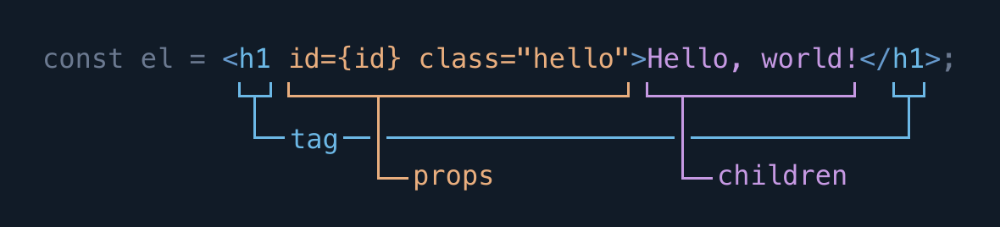

**Note:** If you’re familiar with how JSX and elements work in React, you may want to skip ahead to [the guide for components](./components). Elements in Crank work almost exactly as they do in React.

## Elements

Crank is best used with [JSX](https://facebook.github.io/jsx/), an XML-like syntax extension to JavaScript. It is designed to work with transpilers like Babel and TypeScript out-of-box. JSX transpilers work by transforming JSX expressions into `createElement` factory function calls. For example, in the following code, the JSX expression assigned to `el` transpiles to the `createElement` call assigned to `el1`.

```jsx
/** @jsx createElement */
import {createElement} from "@bikeshaving/crank";

const el = <div id="element">An element</div>;
// transpiles to:
const el1 = createElement("div", {id: "element"}, "An element");
```

The `createElement` function returns an *element*, a JavaScript object. Elements on their own don’t do anything special; instead, Crank provides special classes called *renderers* which interpret elements to produce DOM nodes, HTML strings, WebGL scene graphs, or whatever else you can think of.

Crank ships with two renderer subclasses for web development: one for managing DOM nodes, available through the module `@bikeshaving/crank/dom`, and one for creating HTML strings, available through the module `@bikeshaving/crank/html`. You can use these modules to render interactive user interfaces in the browser and HTML responses on the server.

```jsx
/** @jsx createElement */
import {createElement} from "@bikeshaving/crank";
import {renderer as DOMRenderer} from "@bikeshaving/crank/dom";
import {renderer as HTMLRenderer} from "@bikeshaving/crank/html";

const el = <div id="hello">Hello world</div>;
const node = document.createElement("div");
DOMRenderer.render(el, node);
console.log(node.innerHTML); // <div id="element">Hello world</div>
console.log(HTMLRenderer.render(el)); // <div id="element">Hello world</div>
```

## The Parts of an Element



An element can be thought of as having three main parts: a *tag*, *props* and *children*. These roughly correspond to the syntax for tags, attributes and content in HTML, and for the most part, you can copy-paste HTML into JSX-flavored JavaScript and have things work as you would expect. The main difference is that JSX has to be well-balanced like XML, so void tags must have a closing slash (`<hr />` not `<hr>`). Also, if you forget to close an element or mismatch opening and closing tags, the parser will throw an error, whereas HTML can be unbalanced or malformed and mostly still work. The advantage of using JSX is that it allows you to interpolate arbitrary JavaScript expressions as an element’s tag, props or children.

### Tags
Tags are the first part of a JSX element expression, and can be thought of as the “name” or “type” of the element. JSX parsers will transpile the tag name as the first argument of a `createElement` call. 

```jsx
const intrinsicEl = <div />;
// transpiles to:
const intrinsicEl1 = createElement("div", null);

const componentEl = <Component />;
// transpiles to:
const componentEl1 = createElement(Component, null);
```

By convention, JSX parsers treat lowercase tags as strings and capitalized tags as variables. When a tag is a string, this signifies that the element will be handled by the renderer. We call elements with string tags *host* or *intrinsic* elements, and for both of the web renderers, these elements correspond to actual HTML elements like `div` or `input`. As we’ll see later, elements can also have function tags, in which case the behavior of the element is defined not by the renderer but by the execution of the referenced function. Elements with function tags are called *component elements*.

### Props
JSX parsers coalesce the attribute-like `key="value"` syntax to a single object for each element, and pass this object to the resulting `createElement` call as its second argument.

```jsx
const myClass = "my-class";
const el = <div id="my-id" class={myClass} />;
// transpiles to:
const el1 = createElement("div", {id: "my-id", "class": myClass});

console.log(el.props); // {id: "my-id", "class": "my-class"}
```

We call this object the *props* object, short for “properties.” The value of each prop is a string if the string-like syntax is used (`key="value"`), or it can be an interpolated JavaScript expression by placing the value in curly brackets (`key={value}`). You can use props to “pass” values into host and component elements, similar to how you might pass arguments into functions when invoking them.

If you already have an object that you want to use as props, you can use the special JSX `...` syntax to “spread” it into an element. This works similarly to [ES6 spread syntax](https://developer.mozilla.org/en-US/docs/Web/JavaScript/Reference/Operators/Spread_syntax).

```jsx
const props = {id: "1", src: "https://example.com/image", alt: "An image"};
const el = ;
// transpiles to:
const el1 = createElement("img", {...props, id: "2"});
```

### Children
As with HTML, Crank elements can have contents, placed between its opening and closing tags. These contents are referred to as the element’s *children.* Because elements can have children which are also elements, they form a tree of nodes which we call the *element tree*.

```jsx
const list = (
  <ul>
    <li>Element 1</li>
    <li>Element 2</li>
  </ul>
);
// transpiles to:
const list1 = createElement("ul", null,
  createElement("li", null, "Element 1"),
  createElement("li", null, "Element 2"),
);

console.log(list.props.children.length); // 2
```

JSX parsers interpret the contents of elements which are not themselves elements as strings. However, just as with props, you can use curly brackets to interpolate JavaScript expressions into an element’s children. Besides elements and strings, almost every value in JavaScript can participate in an element tree. Numbers are rendered as strings, and the values `null`, `undefined`, `true` and `false` are erased, allowing you to render things conditionally using boolean expressions.

```jsx
const el = <div>{"a"}{1 + 1}{true}{false}{null}{undefined}</div>;
console.log(el.props.children); // ["a", 2, true, false, null, undefined]
renderer.render(el, document.body);
console.log(document.body.innerHTML); // <div>a2</div>
```

Crank also allows arbitrarily nested iterables of values to be inserted, so, for instance, you can interpolate an array or a set of values into an element tree.

```jsx
const arr = [1, 2, 3];
const set = new Set(["a", "b", "c"]);
renderer.render(<div>{arr} {set}</div>, document.body);
console.log(document.body.innerHTML); // "<div>123 abc</div>"
```

## Element Diffing
Crank uses the same “virtual DOM” diffing algorithm made popular by React, where we compare elements by tag and position to reduce DOM mutations and reuse nodes. This approach allows us to write declarative code which focuses on producing the right tree, while Crank does the dirty work of managing state and mutating the DOM.

```jsx
renderer.render(
  <div>
    <span>1</span>
  </div>,
  document.body,
);

const div = document.body.firstChild;
const span = document.body.firstChild.firstChild;
renderer.render(
  <div>
    <span>1</span>
    <span>2</span>
  </div>,
  document.body,
);

console.log(document.body.firstChild === div); // true
console.log(document.body.firstChild.firstChild === span); // true
```

**Note:** We usually avoid using the term “virtual DOM” in Crank, insofar as the core renderer can be extended to target multiple environments; instead, we use the term “element diffing” to mean mostly the same thing.
